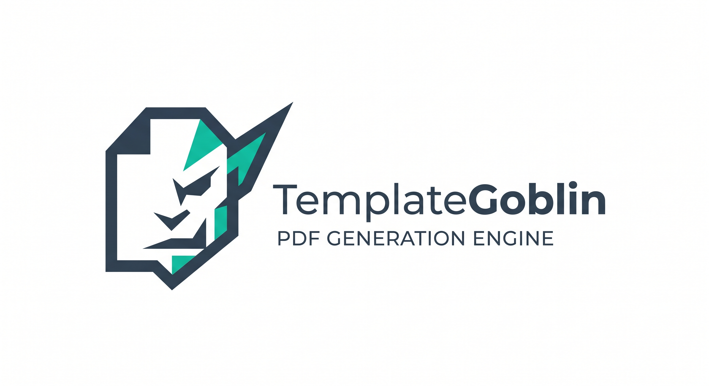

# template-goblin

<div align="center">
  
</div>

PDF template engine for Node.js — load a `.tgbl` template + JSON data and generate a PDF.

```bash
npm install template-goblin
```

```ts
import { writeFile } from 'node:fs/promises'
import { loadTemplate, generatePDF } from 'template-goblin'

const template = await loadTemplate('./result.tgbl')

const pdf = await generatePDF(template, {
  texts: { studentName: 'Aisha Khan', grade: 'A' },
  tables: { subjects: [{ subject: 'Math', marks: '95' }] },
})

await writeFile('result.pdf', pdf)
```

## What is a `.tgbl` template?

A `.tgbl` is a ZIP archive containing the layout, fonts, and images needed to render a page. Design one in the visual builder ([`template-goblin-ui`](https://www.npmjs.com/package/template-goblin-ui)) or hand-craft one with `@template-goblin/types`. Templates are loaded once, then reused for millions of PDFs.

## API

| Function                                   | Purpose                                                  |
| ------------------------------------------ | -------------------------------------------------------- |
| `loadTemplate(path)`                       | Parse a `.tgbl` file into an in-memory `LoadedTemplate`  |
| `generatePDF(template, input)`             | Render a single PDF as a `Buffer`                        |
| `generateBatchPDF(template, inputs, opts)` | Render many PDFs from a shared template                  |
| `validateData(template, input)`            | Validate input JSON against the template's required keys |

Types live in [`@template-goblin/types`](https://www.npmjs.com/package/@template-goblin/types).

## Links

- 📖 **Full docs, examples, and the visual builder** — https://github.com/JaiminPatel345/template-goblin
- 🐛 **Issues & feature requests** — https://github.com/JaiminPatel345/template-goblin/issues
- 📄 **License** — GPLv3
